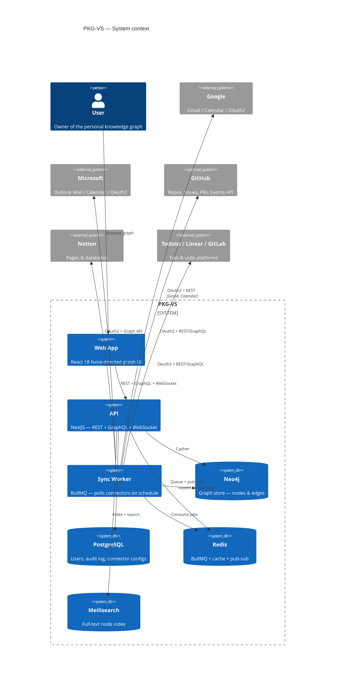

# C4 — Context diagram (spec Appendix D.1)

```mermaid
C4Context
  title PKG-VS — System context

  Person(user, "User", "Owner of the personal knowledge graph")

  System_Boundary(pkg, "PKG-VS") {
    System(web,  "Web App",         "React 18 force-directed graph UI")
    System(api,  "API",             "NestJS — REST + GraphQL + WebSocket")
    System(worker, "Sync Worker",   "BullMQ — polls connectors on schedule")
    SystemDb(neo4j,    "Neo4j",     "Graph store — nodes & edges")
    SystemDb(postgres, "PostgreSQL","Users, audit log, connector configs")
    SystemDb(redis,    "Redis",     "BullMQ + cache + pub-sub")
    SystemDb(meili,    "Meilisearch","Full-text node index")
  }

  System_Ext(google, "Google",      "Gmail / Calendar / OAuth2")
  System_Ext(ms,     "Microsoft",   "Outlook Mail / Calendar / OAuth2")
  System_Ext(github, "GitHub",      "Repos, issues, PRs, Events API")
  System_Ext(notion, "Notion",      "Pages & databases")
  System_Ext(other,  "Todoist / Linear / GitLab", "Task & code platforms")

  Rel(user, web, "Browses graph")
  Rel(web,  api, "REST + GraphQL + WebSocket")
  Rel(api,  neo4j,    "Cypher")
  Rel(api,  postgres, "SQL")
  Rel(api,  redis,    "Queue + pub-sub")
  Rel(api,  meili,    "Index + search")
  Rel(worker, redis,    "Consume jobs")
  Rel(worker, neo4j,    "Upsert nodes/edges")
  Rel(worker, google,   "OAuth2 + REST", "Gmail, Calendar")
  Rel(worker, ms,       "OAuth2 + Graph API")
  Rel(worker, github,   "OAuth2 + REST/GraphQL")
  Rel(worker, notion,   "OAuth2 + REST")
  Rel(worker, other,    "OAuth2 + REST/GraphQL")
```
