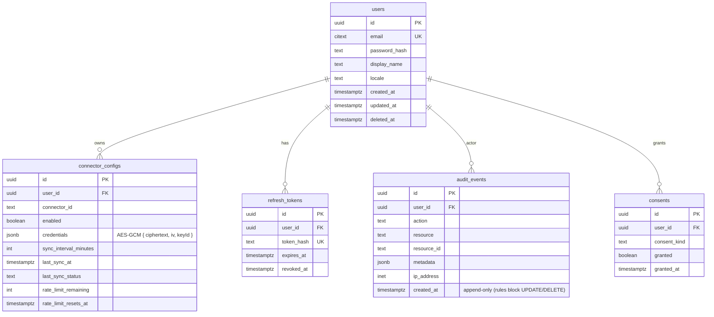

# ERD — PostgreSQL relational tables (spec Appendix D.2)

The graph (nodes/edges) lives in Neo4j; Postgres holds users, sessions, audit, and connector configuration.

```mermaid
erDiagram
  users ||--o{ connector_configs : owns
  users ||--o{ refresh_tokens     : has
  users ||--o{ audit_events       : actor
  users ||--o{ consents           : grants

  users {
    uuid id PK
    citext email UK
    text password_hash
    text display_name
    text locale
    timestamptz created_at
    timestamptz updated_at
    timestamptz deleted_at
  }

  connector_configs {
    uuid id PK
    uuid user_id FK
    text connector_id
    boolean enabled
    jsonb credentials "AES-GCM { ciphertext, iv, keyId }"
    int sync_interval_minutes
    timestamptz last_sync_at
    text last_sync_status
    int rate_limit_remaining
    timestamptz rate_limit_resets_at
  }

  audit_events {
    uuid id PK
    uuid user_id FK
    text action
    text resource
    text resource_id
    jsonb metadata
    inet ip_address
    timestamptz created_at "append-only (rules block UPDATE/DELETE)"
  }

  refresh_tokens {
    uuid id PK
    uuid user_id FK
    text token_hash UK
    timestamptz expires_at
    timestamptz revoked_at
  }

  consents {
    uuid id PK
    uuid user_id FK
    text consent_kind
    boolean granted
    timestamptz granted_at
  }
```
