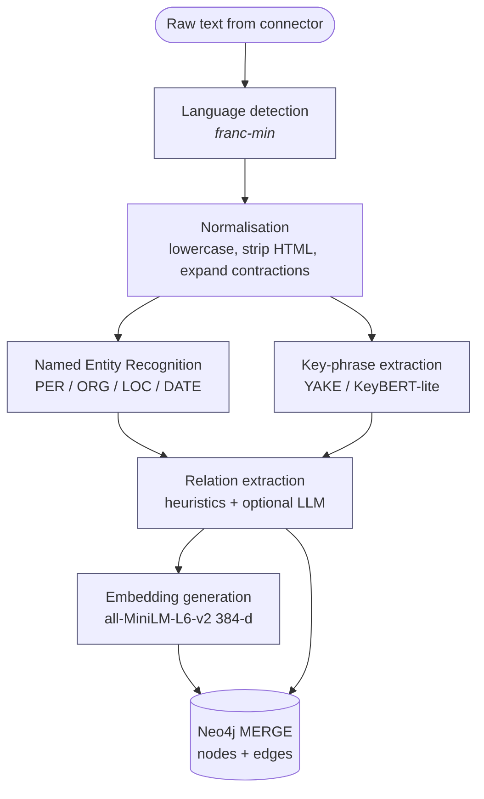

# NLP pipeline (spec §9.3)

```mermaid
flowchart TD
  raw([Raw text from connector]) --> lang[Language detection<br/><i>franc-min</i>]
  lang --> norm[Normalisation<br/>lowercase, strip HTML, expand contractions]
  norm --> ner[Named Entity Recognition<br/>PER / ORG / LOC / DATE]
  norm --> kp[Key-phrase extraction<br/>YAKE / KeyBERT-lite]
  ner --> rel[Relation extraction<br/>heuristics + optional LLM]
  kp --> rel
  rel --> emb[Embedding generation<br/>all-MiniLM-L6-v2 384-d]
  emb --> write[(Neo4j MERGE<br/>nodes + edges)]
  rel --> write

  classDef model fill:#eef,stroke:#557
  class lang,ner,kp,rel,emb model
```
