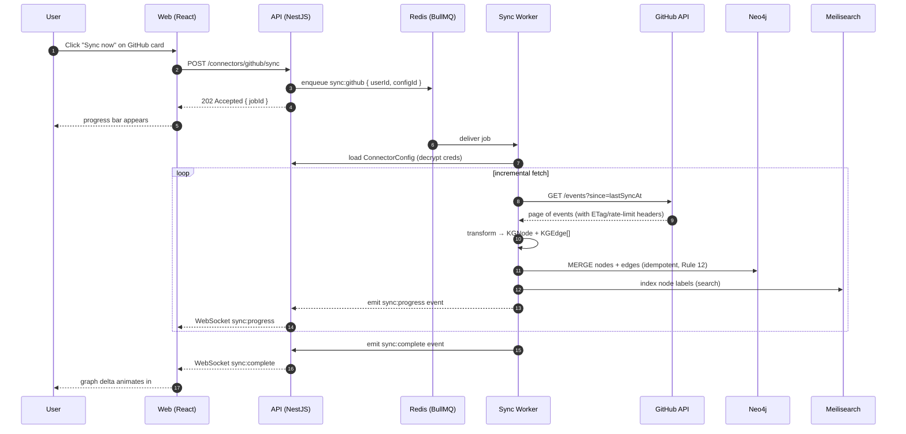

# Sync sequence (spec Appendix D.3)

End-to-end flow when a user clicks **Sync now** for the GitHub connector.

```mermaid
sequenceDiagram
  autonumber
  participant U as User
  participant W as Web (React)
  participant A as API (NestJS)
  participant Q as Redis (BullMQ)
  participant Wk as Sync Worker
  participant G as GitHub API
  participant N as Neo4j
  participant M as Meilisearch

  U->>W: Click "Sync now" on GitHub card
  W->>A: POST /connectors/github/sync
  A->>Q: enqueue sync:github { userId, configId }
  A-->>W: 202 Accepted { jobId }
  W-->>U: progress bar appears

  Q->>Wk: deliver job
  Wk->>A: load ConnectorConfig (decrypt creds)
  loop incremental fetch
    Wk->>G: GET /events?since=lastSyncAt
    G-->>Wk: page of events (with ETag/rate-limit headers)
    Wk->>Wk: transform → KGNode + KGEdge[]
    Wk->>N: MERGE nodes + edges (idempotent, Rule 12)
    Wk->>M: index node labels (search)
    Wk-->>A: emit sync:progress event
    A-->>W: WebSocket sync:progress
  end
  Wk->>A: emit sync:complete event
  A-->>W: WebSocket sync:complete
  W-->>U: graph delta animates in
```
